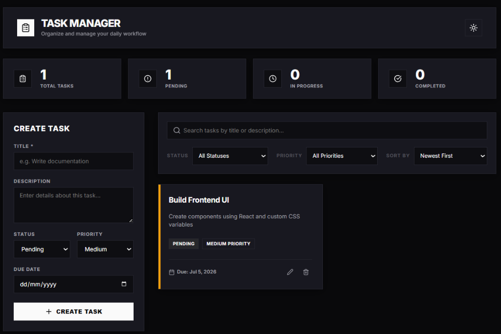

# Task Manager - Full Stack Application

Task Manager is a production-quality, responsive task management application built with a React frontend and a Node.js/Express backend, backed by MongoDB. It features a premium, glassmorphic dark-mode-first theme with a light mode toggle, real-time statistics dashboard, debounced searching, status/priority filtering, due date sorting, and interactive confirmation pop-ups.

---

## Technical Stack

### Frontend
* **Core:** React.js, Vite
* **HTTP Client:** Axios
* **Styling:** Custom Vanilla CSS with CSS custom properties (variables)
* **Icons:** Lucide React

### Backend
* **Runtime:** Node.js
* **Framework:** Express.js
* **Database Driver:** Mongoose (MongoDB)
* **Configuration:** dotenv, cors

---

## Folder Structure

```
Task Manager/
├── backend/
│   ├── config/             # Database connection setup
│   ├── controllers/        # Express request controllers
│   ├── middleware/         # Centralized error handler
│   ├── models/             # Mongoose schemas & validations
│   ├── routes/             # REST routing configurations
│   ├── utils/              # Operational error wrappers & wrappers
│   ├── .env.example        # Environment variable template
│   ├── server.js           # Express entrypoint
│   └── package.json
└── frontend/
    ├── src/
    │   ├── components/     # UI presentation components
    │   ├── pages/          # Layout wrapper pages (Dashboard)
    │   ├── services/       # Axios API layer functions
    │   ├── hooks/          # React useTasks state management hook
    │   ├── utils/          # Date and overdue helpers
    │   ├── styles/         # Glassmorphism dark/light design system
    │   ├── App.jsx         # App router mount
    │   └── main.jsx        # Root render script
    ├── .env.example        # Env variable template
    ├── index.html
    └── package.json
```

---

## Features

1. **Complete CRUD Operations:** Create, retrieve, update, and delete tasks dynamically.
2. **Advanced Filtering & Search:**
   * Filter by status (`Pending`, `In Progress`, `Completed`)
   * Filter by priority (`Low`, `Medium`, `High`)
   * Case-insensitive regex title & description search
3. **Debounced Search Queries:** Postpones API updates by 400ms while typing to optimize server-load.
4. **Smart Task Sorting:** Sort lists by Newest, Oldest, or Due Date.
5. **Interactive Actions:** Delete confirmation overlay prompt, custom loading spinners, and empty list illustrations.
6. **Toast Notification Engine:** Displays timed alerts for successful operations and maps raw server errors to user-friendly messages.
7. **Premium Glassmorphic Design:** Smooth animations, glowing focus rings, responsive columns, and localStorage-persisted light/dark theme toggling.

---

## API Endpoints

All endpoints are mapped to `/tasks` prefix:

| Method | Endpoint | Description | Query Parameters |
|:---|:---|:---|:---|
| **GET** | `/tasks` | Fetch list of tasks | `search`, `status`, `priority`, `sortBy` |
| **GET** | `/tasks/:id` | Fetch task details | None |
| **POST** | `/tasks` | Create a new task | None (requires JSON body) |
| **PUT** | `/tasks/:id` | Update task details | None (requires JSON body) |
| **DELETE** | `/tasks/:id`| Remove a task | None |

---

## Environment Variables

### Backend (`backend/.env`)
```env
PORT=5050
MONGO_URI=mongodb://127.0.0.1:27017/taskmanager (for local instance)
```

### Frontend (`frontend/.env`)
```env
VITE_API_URL=http://localhost:5050
```

---

## Local Development Setup

### Prerequisites
* [Node.js](https://nodejs.org) (v16+ recommended)
* [MongoDB](https://www.mongodb.com/) running locally (or via Docker: `docker run -d --name mongodb -p 27017:27017 mongo:latest`)

### Step 1: Clone and install backend
1. Open terminal in the `backend/` directory.
2. Create your `.env` file from the example:
   ```bash
   cp .env.example .env
   ```
3. Install dependencies:
   ```bash
   npm install
   ```
4. Start the server in development mode:
   ```bash
   npm run dev
   ```

### Step 2: Install and start frontend
1. Open terminal in the `frontend/` directory.
2. Create your `.env` file from the example:
   ```bash
   cp .env.example .env
   ```
3. Install dependencies:
   ```bash
   npm install
   ```
4. Run the local dev server:
   ```bash
   npm run dev
   ```
5. Open browser at `http://localhost:5173`.

---

## Deployment Instructions

### Database (MongoDB Atlas)
1. Sign up for [MongoDB Atlas](https://www.mongodb.com/cloud/atlas).
2. Create a free shared cluster.
3. Whitelist access from all IP addresses (`0.0.0.0/0`) for cloud hosting.
4. Copy the connection URI and replace credentials.

### Backend (Render)
1. Log in to [Render](https://render.com).
2. Click **New +** and select **Web Service**.
3. Connect your repository.
4. Set **Build Command** to `npm install`.
5. Set **Start Command** to `npm start`.
6. Add environment variables:
   * `PORT` (e.g. `10000`)
   * `MONGO_URI` (your MongoDB Atlas connection string)
   * `NODE_ENV` (`production`)

### Frontend (Vercel)
1. Log in to [Vercel](https://vercel.com).
2. Create a new project, linking your Git repository.
3. Configure the Root Directory to `frontend`.
4. In **Build & Development Settings**, Vite settings will automatically be detected.
5. In **Environment Variables**, add:
   * `VITE_API_URL` (your deployed Render service endpoint, e.g., `https://your-service.onrender.com`)
6. Click **Deploy**.

## Preview


